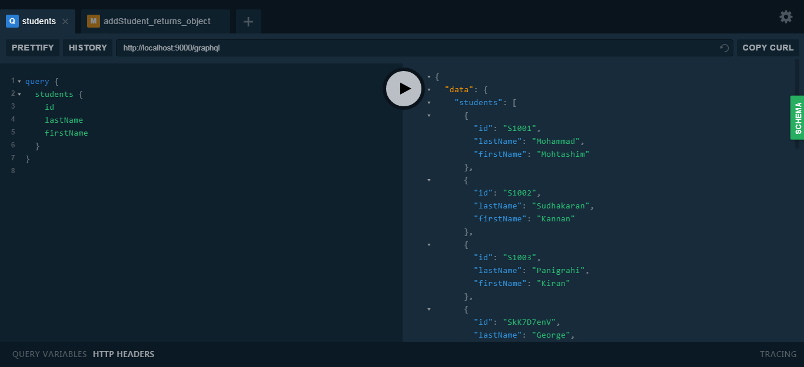
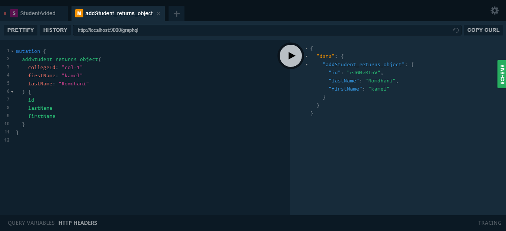
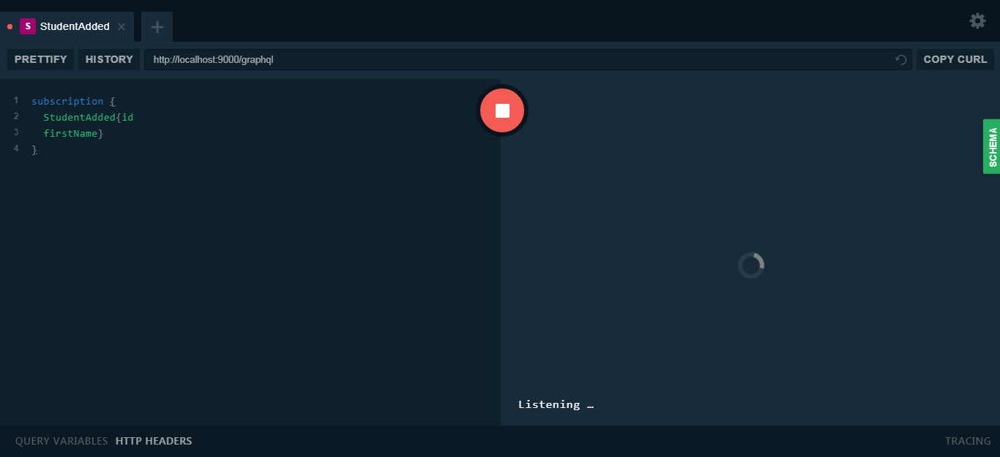
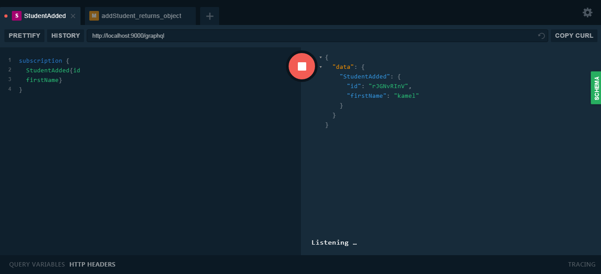

# graphql-server-apollo2

#### How to use :

- Download or clone the project
- Open VS code and import it
- Cd the repository and Run `npm install`
- execute the following command `node start.js` inside the graphql-server-apollo2 folder

 endpoint : http://localhost:9000/graphql

 ## Query example

 

## Mutation example

## Subscription example

